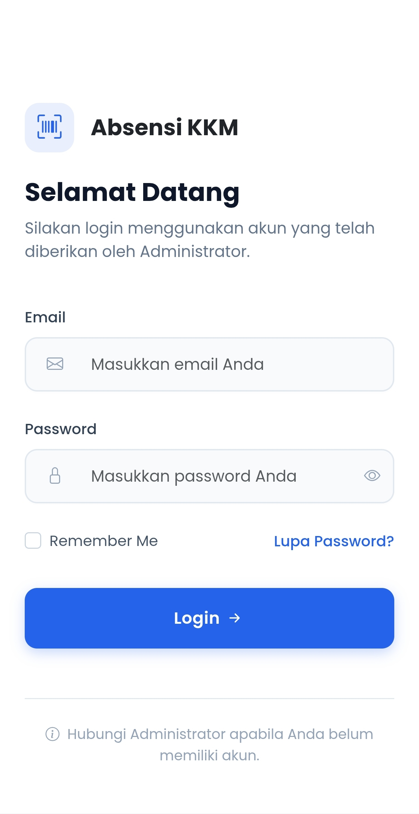
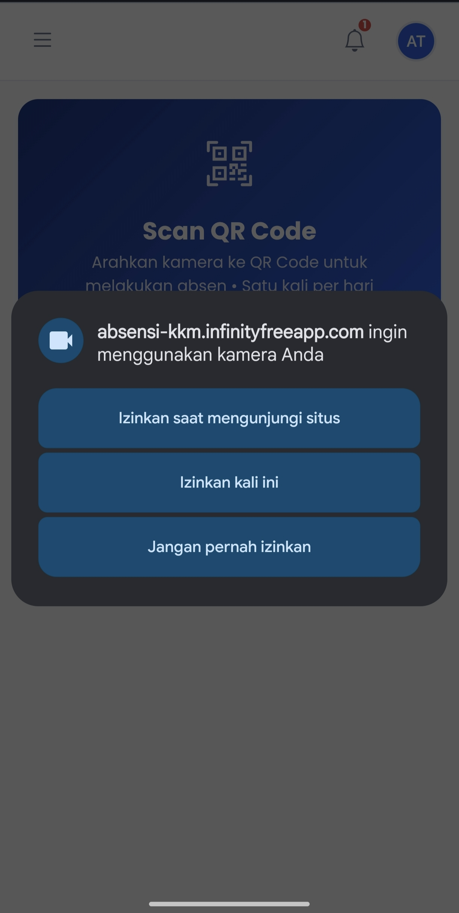

# 📌 Sistem Absensi KKM Berbasis QR Code

Sistem Absensi KKM adalah aplikasi berbasis website yang digunakan untuk membantu proses pencatatan kehadiran anggota KKM secara digital menggunakan teknologi QR Code.

Dengan sistem ini, proses absensi anggota menjadi lebih mudah, cepat, dan data kehadiran tersimpan secara otomatis.

---

# 👥 Jenis Akun Pengguna

Pada sistem ini terdapat 2 jenis akun:

## 🔹 Administrator

Administrator bertugas untuk mengelola seluruh data sistem.

Fitur Administrator:

- Membuat akun anggota KKM
- Mengelola data anggota
- Mengubah password anggota
- Membuat QR Code absensi
- Melihat rekap absensi
- Export laporan Excel
- Monitoring aktivitas sistem


## 🔹 Anggota KKM

Akun anggota digunakan untuk melakukan absensi harian.

Fitur anggota:

- Login akun
- Scan QR Code absensi
- Melihat riwayat absensi
- Mengubah profil


---

# 🔐 Cara Login Anggota KKM

Akun anggota dibuat terlebih dahulu oleh Administrator.

Setiap anggota akan mendapatkan:

```
Email
Password
```

yang sudah diberikan oleh pengurus KKM.


Langkah login:

## 1. Buka Website Absensi KKM

Masuk ke halaman login website.


<p align="center">
  
</p>


---

## 2. Masukkan Akun

Isi:

```
Email
Password
```

sesuai akun yang diberikan Administrator.


Kemudian klik:

```
Login
```


---

## 3. Masuk Dashboard

Jika berhasil login, anggota akan diarahkan ke halaman dashboard.


<p align="center">
  
</p>


---

# 📷 Cara Melakukan Absensi QR Code


## 1. Pilih Menu Scan QR Absen

Pada halaman dashboard pilih:

```
Scan QR Absen
```


<p align="center">
  
</p>


---

## 2. Izinkan Akses Kamera

Ketika pertama kali membuka scanner, browser akan meminta izin kamera.

Jika muncul notifikasi:

```
Izinkan website menggunakan kamera?
```

Pilih:

```
Izinkan / Allow
```

atau pilih tombol pertama untuk memberikan akses kamera.


<p align="center">
  
</p>


---

## 3. Scan QR Code

Setelah kamera terbuka:

- Arahkan kamera ke QR Code yang diberikan Administrator
- Pastikan QR terlihat jelas
- Tunggu sampai proses scan selesai


<p align="center">
  
</p>


---

## 4. Absensi Berhasil

Jika berhasil, sistem otomatis menyimpan:

- Nama anggota
- Tanggal absensi
- Jam absensi
- Status kehadiran


---

# ⚠️ Kamera Tidak Muncul

Apabila kamera tidak muncul:

Lakukan langkah berikut:


## Android / Google Chrome


1. Klik ikon gembok atau pengaturan di sebelah alamat website


<p align="center">
  
</p>


2. Pilih:

```
Izin Situs / Permission
```


3. Ubah kamera menjadi:

```
Izinkan / Allow
```


4. Refresh halaman

5. Buka kembali Scan QR Absen


---

# 📅 Melihat Riwayat Absensi

Untuk melihat data kehadiran:

Pilih menu:

```
Riwayat Absensi
```


Data yang tampil:

- Tanggal hadir
- Jam absen
- Status kehadiran


---

# 🔑 Lupa Password

Reset password melalui email tidak digunakan.

Apabila anggota lupa password:

Silakan hubungi:

- Ketua KKM
- Sekretaris KKM
- Administrator Sistem


Administrator akan membantu mengganti password akun.


---

# 📊 Keterangan Status Absensi


## 🟢 Hadir

Anggota berhasil melakukan absensi sesuai waktu yang ditentukan.


## 🟡 Terlambat

Anggota melakukan absensi melewati batas waktu yang ditentukan.


---

# 💻 Teknologi Sistem

Sistem dibuat menggunakan:

- Laravel Framework
- PHP
- MySQL Database
- Bootstrap
- JavaScript
- QR Code Scanner
- Laravel Excel


---

# 📌 Tentang Aplikasi

Sistem Absensi KKM dibuat untuk membantu digitalisasi kegiatan Kuliah Kerja Mahasiswa.

Tujuan sistem:

- Mengurangi penggunaan absensi manual
- Mempermudah pencatatan kehadiran
- Mempercepat proses absensi
- Membantu pembuatan laporan kegiatan


---

# 👨‍💻 Developer

Dikembangkan untuk mendukung kegiatan KKM dengan pemanfaatan teknologi informasi.

© 2026 Sistem Absensi KKM
